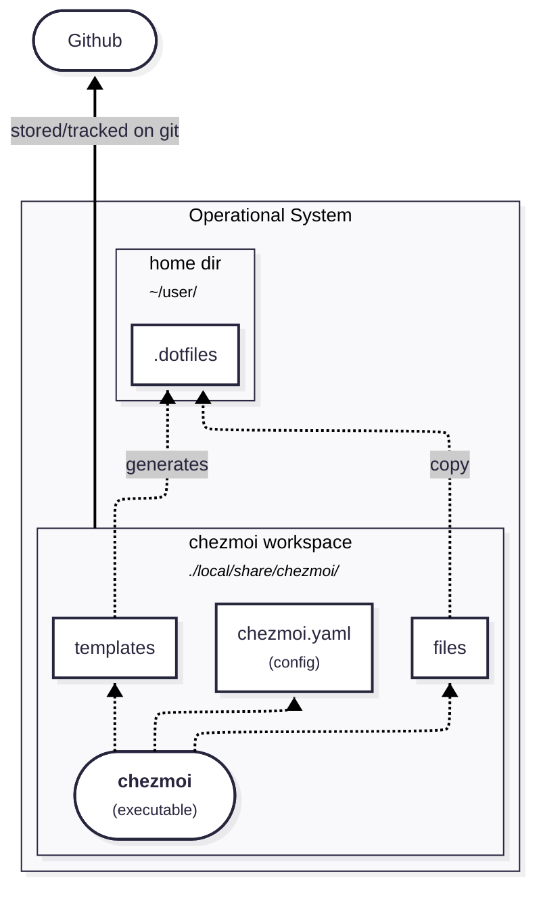

# Rodrigo’s Dotfiles

This repository contains my personal dotfiles, managed with **chezmoi**.  
It supports **macOS** and **Fedora Linux**.

---

## Diagram




## Requirements

- `curl`
- `git`
- GitHub Personal Access Token (PAT) for the first setup (only needed if SSH isn't configured yet)

---

## Quick Start (new machine)

```bash
bash -c "$(curl -fsSL https://raw.githubusercontent.com/rmelo/dotfiles/main/bootstrap.sh)"
```

The script will:
1. Install Homebrew (macOS) or use dnf (Fedora)
2. Install Ansible and chezmoi
3. Prompt for your name, email, and SSH signing key
4. Run `chezmoi init` + `chezmoi apply`
5. Run `ansible-playbook` to install all tools

⚠️ `~/.config/chezmoi/chezmoi.yaml` is created locally and must not be committed.

---

## Manual Setup

If you prefer step-by-step:

### 1. Install chezmoi

```bash
sh -c "$(curl -fsLS get.chezmoi.io)"
```

### 2. Configure local variables

```bash
mkdir -p ~/.config/chezmoi
vim ~/.config/chezmoi/chezmoi.yaml
```

```yaml
data:
  name: "Your name"
  email: "Your git email"
  git:
    sshSigningKey: "Your signing key"
```

### 3. Init and apply dotfiles

```bash
chezmoi init https://github.com/rmelo/dotfiles.git
chezmoi apply
```

### 4. Install tools via Ansible

```bash
make install
```

### 5. Switch to SSH remote (recommended)

After your SSH keys are set up via 1Password:

```bash
cd ~/.local/share/chezmoi
git remote set-url origin git@github.com:rmelo/dotfiles.git
```

---

## Updating

```bash
chezmoi update
```

Useful commands:
```bash
chezmoi diff     # Preview changes
chezmoi apply    # Apply changes
chezmoi doctor   # Validate setup
```
